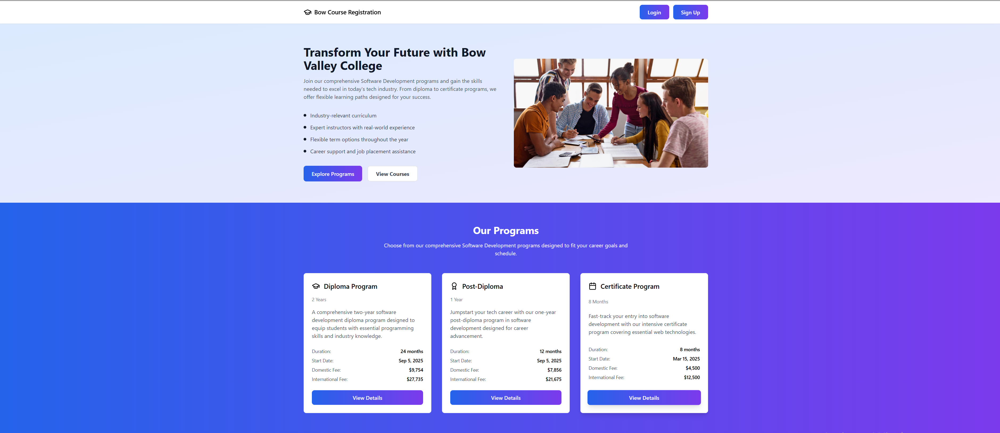

# course-registration-system

A full-stack course registration system built using React, Node.js, and SQL as part of a team project at Bow Valley College.

## My Contributions
- Developed responsive front-end components using React, HTML, CSS, and JavaScript
- Integrated REST APIs to enable course registration functionality
- Collaborated with a team using GitHub version control and Agile workflows
- Participated in debugging, testing, and peer code reviews

## Features
- Student course registration
- Course listing and management
- API integration with backend services
- Responsive user interface

## Tech Stack
- Frontend: React, JavaScript, HTML, CSS
- Backend: Node.js, Express
- Database: SQL

## Team Project Note
This was a collaborative academic project.  
👉 View full team repository here: https://github.com/pedromolina1986/TheBowCourseRegistration

## Author
Nonyelum Ogbuakanne
